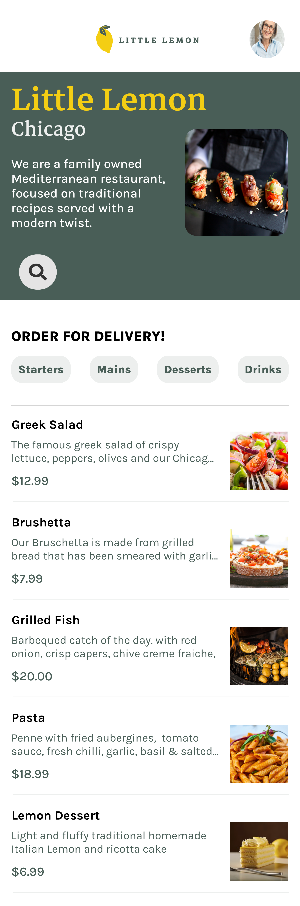

# Little Lemon Restaurant iOS App

A modern iOS restaurant application developed as part of the Meta iOS Developer Certificate program.

## Features
- User onboarding and account creation
- Seamless navigation experience
- Local data persistence using Core Data
- Advanced menu filtering and sorting
- Responsive design optimized for iOS devices

## Technical Details
- SwiftUI for modern UI development
- Core Data for offline data storage
- API integration for menu synchronization
- Custom filtering and search functionality

## Design
The app was designed using Figma and follows Meta's design guidelines.

## Screenshots

## Style Guide
[View Style Guide](docs/StyleGuide.pdf)

